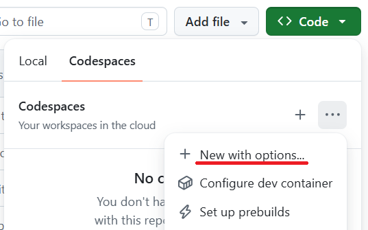
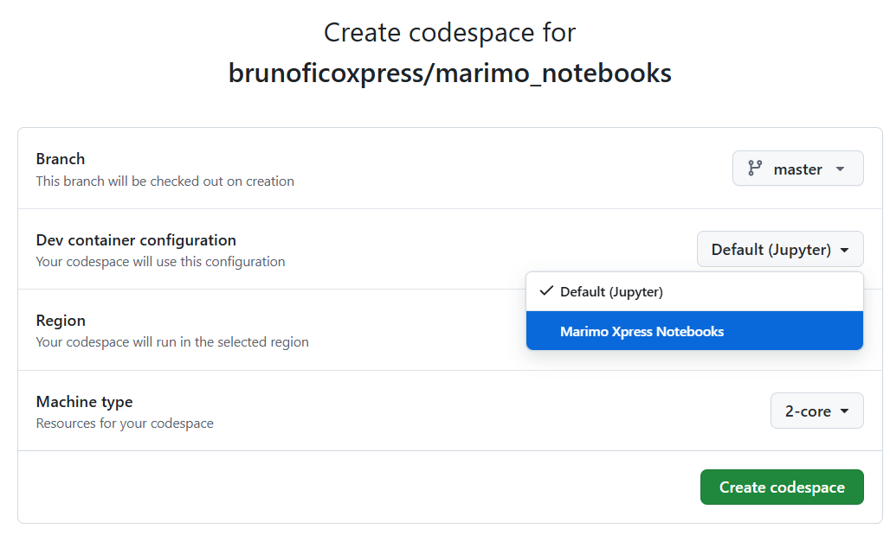
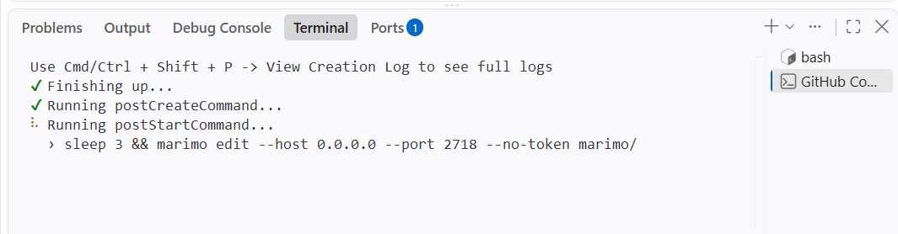
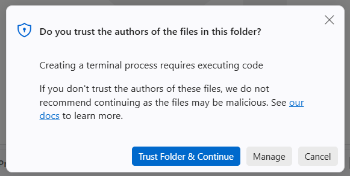
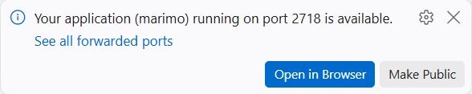
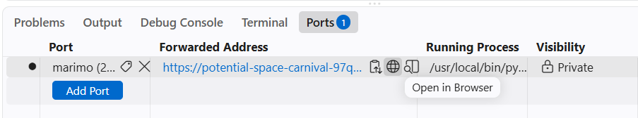
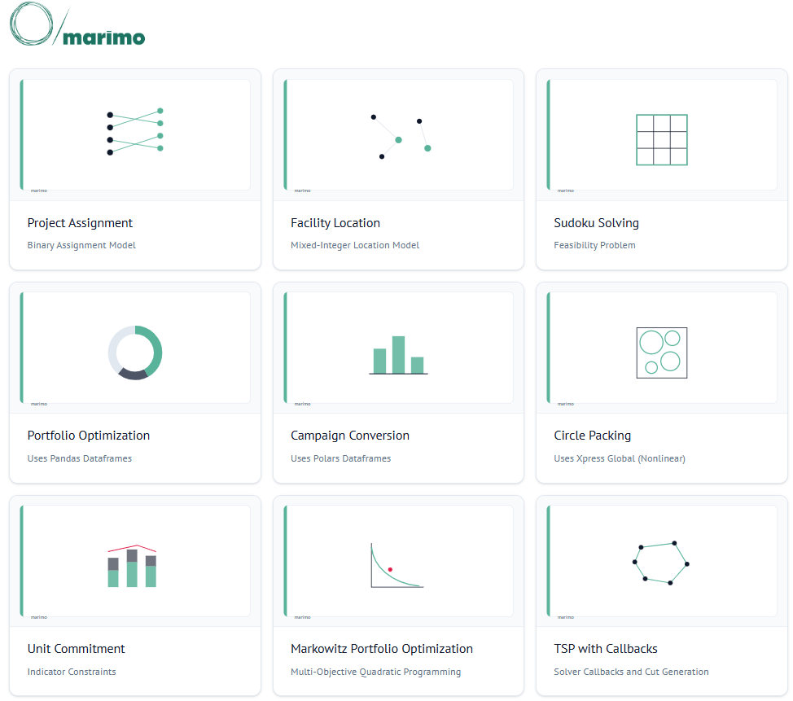
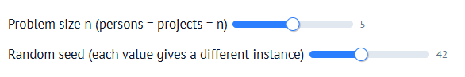

# Marimo notebooks

FICO&reg; Xpress Python example notebooks built with [marimo](https://marimo.io/), a reactive, browser-based notebook format.

**Just want to take a look, not run code?** See the [live read-only gallery](https://fico-xpress.github.io/python-notebooks/), a static export of every notebook below, no installation or Codespace setup needed. Each page is a static snapshot: sliders and other interactive controls will not respond. Follow the steps below to run a notebook interactively.

## Getting started

* [Running marimo notebooks in GitHub Codespaces](#running-marimo-notebooks-in-github-codespaces)
* [Running marimo notebooks locally](#running-marimo-notebooks-locally)

## Running marimo notebooks in GitHub Codespaces

Please note that the creation of the codespace may take 3-4 minutes; we ask for your patience during this step.

1. On the repository's GitHub page, click **Code**, then open the **Codespaces** tab.
2. Click the **...** icon next to **Create codespace on master** and select **New with options**.

   <p align="center"></p>

3. In the **Dev container configuration** dropdown, choose **Marimo Xpress Notebooks** (not the default "Jupyter" configuration).

   <p align="center"></p>

4. Click **Create codespace**. Building the environment takes about 3-4 minutes. You can follow progress in the terminal panel at the bottom; the setup is finished once you see a message confirming marimo has started and is listening on port 2718.

   <p align="center"></p>

5. At some point during setup, VS Code may show a **"Do you trust the authors of the files in this folder?"** popup. This is a one-time security prompt from VS Code itself (not something this repository controls), and it is expected. Click **Yes, I trust the authors** to continue.

   <p align="center"></p>

6. Once the port is ready, VS Code shows a notification with an **Open in Browser** button. Click it to open the marimo home page in a new browser tab.

   <p align="center"></p>

   If you miss the notification or it disappears, open the **Ports** tab next to the terminal instead. You should see port **2718** listed with the label `marimo`. Click the link under the **Forwarded Address** column for that row to open it in your browser (the **Add Port** button is for forwarding a *new* port and has no effect here, since port 2718 is already forwarded).

   <p align="center"></p>

7. Once the tab opens, you will see the marimo home page: a grid of notebook thumbnails, each with a title and short subtitle, similar to the screenshot below.

   <p align="center"></p>

8. Click any notebook, for example **Project Assignment**. Every cell runs automatically as soon as the notebook opens. Try moving one of the sliders, for example the problem-size slider, and watch every dependent cell re-run automatically, updating the results table and chart in real time.

   <p align="center"></p>

## Running marimo notebooks locally

If you would rather not use Codespaces, you can run the notebooks on your own machine instead.

**Prerequisites:** [Python 3.11+](https://www.python.org/downloads/) and [Git](https://git-scm.com/downloads) installed.

1. Clone the repository and move into the `marimo/` folder:

   ```bash
   git clone https://github.com/fico-xpress/python-notebooks.git
   cd python-notebooks/marimo
   ```

2. Install the notebook dependencies. Using a virtual environment is optional but recommended so these packages don't clash with anything else on your machine:

   ```bash
   python -m venv .venv
   .venv\Scripts\activate      # on Windows
   source .venv/bin/activate   # on macOS/Linux

   pip install -r requirements.txt
   ```

3. Launch any notebook with `marimo edit` (opens the notebook in editable mode, so you can also modify the code) or `marimo run` (opens it in read-only run mode, matching the Codespaces experience where all cells auto-run and only the modelling code stays visible):

   ```bash
   marimo edit 01_assignment.py
   # or, to browse all notebooks from a single home page like in Codespaces:
   marimo run .
   ```

   Either command starts a local server and should open a new browser tab automatically at `http://localhost:2718`. If it doesn't, copy that URL into your browser manually.

## Legal and license requirements

See [Legal and license requirements](../README.md#legal-and-license-requirements) in the main README.
